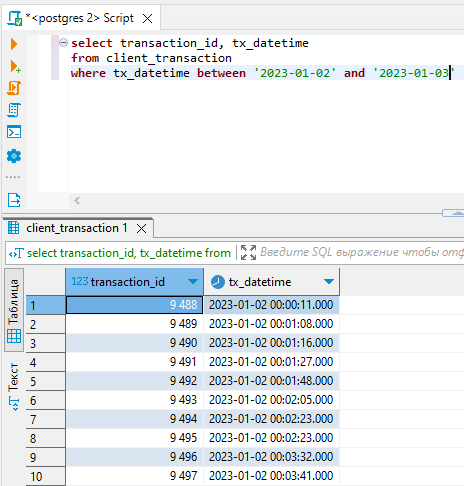
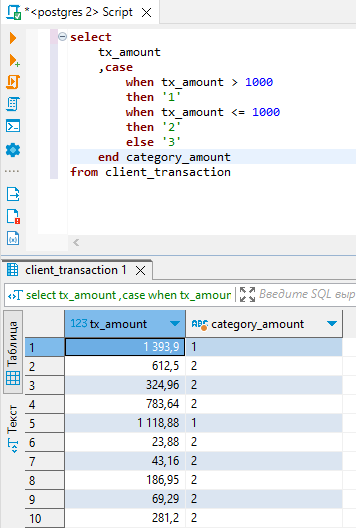
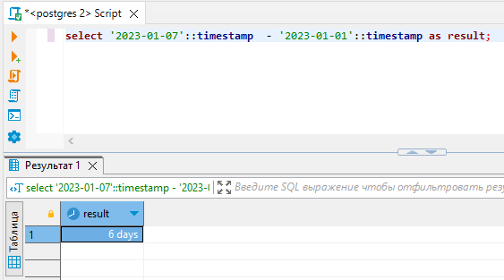

| **Цель занятия** |

-   Рассмотреть выполнение запросов на выборку данных из таблицы по заданному условию.

 |
| **План занятия** |

-   Арифметические, логические операторы и операторы сравнения.
-   Оператор SELECT.
-   Использование в запросах операторов BETWEEN, IN, LIKE и т. д. Операторы EXISTS, CASE, DISTINCT.
-   Работа с датами.

 |

* * * * *

Арифметические операторы

В SQL поддерживаются арифметические операторы, которые приведены в таблице.

| **+ (сложение)** | Сложение значения операндов |
| **- (вычитание)** | Вычитание значения операндов |
| *** (умножение)** | Умножение значения операндов |
| **/ (деление)** | Разделение значения операндов |
| **% (модуль)** | Остаток от деления операндов |

Логические операторы

Для выполнения проверок условий есть логические операторы, такие как `AND`, `OR`, `ANY`, `BETWEEN` и другие.

| **ALL** | Используется для сравнения значения со всеми значениями в другом наборе |
| **AND** | Допускает существование множества условий в инструкции WHERE |
| **ANY** | Используется для сравнения значения с любым применимым значением в списке в соответствии с условием |
| **BETWEEN** | Используется для поиска значений, находящихся в пределах набора значений, с учетом минимального и максимального значения |
| **EXISTS** | Используется для проверки, существует ли в указанной таблице строка, которая соответствует определенному критерию |
| **IN** | Используется для сравнения значения со списком уникальных литеральных значений |
| **LIKE** | Используется для сравнения значения с аналогичными значениями с помощью подстановочных операторов |
| **NOT** | Меняет на противоположный смысл логического оператора, с которым используется |
| **OR** | Используется для объединения нескольких условий в инструкции WHERE |
| **IS NULL** | Используется для сравнения значения со значением NULL |
| **UNIQUE** | Выполняет проверку каждой строки в указанной таблице на уникальность |

Операторы сравнения

Помимо арифметических и логических операторов в SQL есть операторы сравнения. К ним относятся операторы, представленные в таблице.

| **=** | Проверяет, равны ли значения двух операторов, если да, то условие становится истинным |
| **!=** | Проверяет, равны ли значения двух операторов, если значения не равны, то условие становится истинным |
| **<>** | Проверяет, равны ли значения двух операторов, если значения не равны, то условие становится истинным |
| **>** | Проверяет, превышает ли значение левого операнда значение правого операнда. Если да, тогда условие становится истинным |
| **<** | Проверяет, является ли значение левого операнда меньшим, чем значение правого операнда. Если да, тогда условие становится истинным |
| **>=** | Проверяет, превышает или равно ли значение левого операнда значению правого операнда. Если да, тогда условие становится истинным |
| **<=** | Проверяет, является ли значение левого операнда меньшим или равным значению правого операнда. Если да, тогда условие становится истинным |

Оператор SELECT

Для выборки строк таблицы по заданному условию используется оператор `SELECT`.

Оператор `SELECT` считается обязательным в запросе, однако в зависимости от запроса `WHERE`, `GROUP BY`, `HAVING` и `ORDER BY` могут отсутствовать, т. е. они не являются обязательными:

-   `SELECT` --- задает список возвращаемых столбцов, которые могут быть как уже существующие, так и вычисляемые; имена столбцов; ограничения на уникальность строк в возвращаемом наборе; ограничения на количество строк в возвращаемом наборе.
-   `FROM` --- задает табличное выражение, которое определяет базовый набор данных для применения операций, определяемых в других предложениях оператора.
-   `WHERE` --- задает условие на выбор строк из таблицы/табличного выражения, указанного после ключевого слова FROM.
-   `GROUP BY` --- объединяет записи (строки), имеющие одинаковое свойство и применяет агрегатные функции.
-   `HAVING` осуществляет выбор среди групп, которые определены параметром GROUP BY.
-   `ORDER BY` используется для сортировки строк.

Оператор SELECT имеет следующую структуру:

Примеры

Выведем строку `'hello world'`:

Выведем пару столбцов из таблицы:

Выведем пару столбцов из таблицы, ограничив количество записей двумя строками:

Выведем пару столбцов из таблицы, добавив условие с операторами сравнения:

Выведем пару столбцов из таблицы, добавив условие с логическими операторами:

Выведем уникальные id терминалов, сортируя их по возрастанию:

Другие операторы

При выборке данных может потребоваться выполнить проверку на соответствие строкового поля заданному шаблону. Это можно выполнить с помощью `LIKE`.

Для определения шаблона могут применяться ряд специальных символов подстановки:

-   `%:` соответствует любой подстроке, которая может иметь любое количество символов, при этом подстрока может и не содержать ни одного символа;
-   `_:` соответствует любому одиночному символу.

Выведем уникальных клиентов, у которых id начинается с 88:

Выведем уникальных клиентов, у которых id начинается с 8 (ограничено на два символа):

Также часто используемыми в запросах являются операторы `EXISTS`, `CASE` и `DISTINCT`.

Выведем сумму транзакции и категорию транзакций с помощью оператора `CASE`:

Выведем уникальные id терминалов с помощью оператора `DISTINCT`:

Работа с датами

Напомним, что в PostgreSQL есть четыре типа данных для работы со временем:

-   `date` --- дата без временной части. Дату удобно задавать в формате 'YYYY-MM-DD' .
-   `timestamp` --- дата со временем. Данный тип данных отличается от типа date наличием временной составляющей, которая позволяет хранить время с точностью до микросекунды.
-   `interval` --- интервал времени между датами.\
    Обычно задается в текстовом формате *(interval '4 day 1 week 30 minute')*
-   `time` --- время без даты.

Также в PostgreSQL существуют специальные значения времени и полезные функции для работы с датами. В дополнение к этому поддерживаются арифметические операции с ними.

Временная арифметика

Арифметические операции доступны для всех временных типов данных:

| **Оператор → Возвращаемый тип данных** | **Описание** |
| date + integer → date | Добавление количества дней к дате |
| date + interval → timestamp | Добавление интервала к дате |
| date + time → timestamp | Добавление времени суток к дате |
| interval + interval → interval | Добавление интервалов |
| timestamp + interval → timestamp | Добавление интервала к метке времени |
| time + interval → time | Добавление интервала ко времени |
| date - date → integer | Вычитаем даты, получая количество прошедших дней |
| date - integer → date | Вычитание количества дней из даты |
| date - interval → timestamp | Вычитание интервала из даты |
| time - time → interval | Вычитание времени |
| time - interval → time | Вычитание интервала из времени |
| timestamp - interval → timestamp | Вычитание интервала из метки времени |
| interval - interval → interval | Вычитание интервалов |
| timestamp - timestamp → interval | Вычитание временных меток (преобразование 24-часовых интервалов в дни, аналогично justify_hours()) |

Если в операции участвуют только переменные с типом `date`, то результатом будет целое число, означающее количество дней между указанными датами.

date - date = число дней (integer):

Если при вычислении интервала между датами есть хотя бы одна переменная с типом `timestamp`, то результатом вычисления будет значение с типом `interval`.

timestamp - timestamp = interval:

В арифметических временных операциях можно произвольно смешивать временные типы данных. В этом случае `date` преобразуется в `timestamp`.

Значения времени можно уменьшать или увеличивать на заданный интервал, результатом будет значение с типом `timestamp`:

Интервалы можно складывать и вычитать между собой, делить и умножать на произвольные вещественные числа.

Важно помнить, что интервалы хранят данные в 3 отдельных полях: месяцах, днях и секундах. Поэтому арифметика с интервалами специфичная и условно **часы не могут превращаться в дни, дни в месяцы и т. д.**

Специальные значения времени

В PostgreSQL есть строковые константы, которые преобразуются в реальные значения времени в момент выполнения запроса.

**`epoch`** --- возвращает нулевое время отчета Unix-систем:

`**infinity**` --- возвращает дату, которая, как принято считать, находится позже любой другой даты:

`**today**` и `**now**` --- возвращают текущую дату:

`**current_date**` и `**current_timestamp**` --- возвращают текущую дату:

`**tomorrow**` --- возвращает дату завтрашнего дня:

`**yesterday**` --- возвращает дату вчерашнего дня:

| **Функция** | **Возвращаемый тип данных** | **Описание** |
| **CURRENT_DATE** | DATE | Возвращает текущую дату |
| **CURRENT_TIME** | TIMESTAMPTZ | Возвращает текущее время |
| **CURRENT_TIMESTAMP** | TIMESTAMPTZ | Возвращает текущую дату и время с указанием часового пояса, в котором начинается текущая транзакция |
| **DATE_PART** | DOUBLE PRECISION | Возвращает значение временной метки или интервала --- например, год, месяц, день и т. д. |
| **DATE_TRUNC** | TIMESTAMP | Возвращает временную метку, усеченную с заданной точностью |
| **EXTRACT** | DOUBLE PRECISION | Аналогично DATE_PART()  |
| **NOW** | TIMESTAMPTZ | Возвращает дату и время с указанием часового пояса, в котором начинается текущая транзакция |

Полезные функции

Теперь давайте рассмотрим функцию `date_trunc`, которая помогает округлить дату. Функция `date_trunc` концептуально аналогична trunc-функции для чисел:

Существуют следующие константы для округления даты:

-   `microseconds` --- до микросекунд;
-   `milliseconds` --- до миллисекунд;
-   `second` --- до секунд;
-   `minute` --- до минут;
-   `hour` --- до часов;
-   `day` --- до дней;
-   `week` --- до недели;
-   `month` --- до месяца;
-   `quarter` --- до квартала;
-   `year` --- до года;
-   `decade` --- до десятилетия;
-   `century` --- до века;
-   `millennium` --- до тысячелетия.

Также для получения полей времени применяются функции `EXTRACT` или `date_part`:

Получить можно следующие поля:

-   `century` --- номер столетия;
-   `day` --- день месяца;
-   `decade` --- номер десятилетия;
-   `dow` --- день недели (0 --- воскресение, а 6 --- суббота);
-   `isodow` --- день недели (1 --- понедельник, а 7 --- воскресенье);
-   `doy` --- день года;
-   `epoch` --- количество секунд с начала отчета Unix-времени;
-   `hour` --- час;
-   `isoyear` --- год в формате ISO 8601;
-   `microseconds` --- микросекунды;
-   `millennium` --- номер тысячелетия;
-   `milliseconds` --- миллисекунды;
-   `minute` --- минуты;
-   `month` --- месяц;
-   `quarter` --- квартал (с 1 по 4);
-   `second` --- секунда;
-   `timezone` --- зона времени в секундах;
-   `timezone_hour` --- час зоны времени;
-   `timezone_minute` --- минута зоны времени;
-   `week` --- номер недели года;
-   `year` --- год.

* * * * *

Итоги занятия:

-   PostgreSQL поддерживает арифметические, логические операторы, операторы сравнения и работу с датами.
-   Для формирования выборок по заданному условию используется оператор SELECT. Для фильтрации данных часто используются операторы BETWEEN, LIKE, DISTINCT и другие.

Источники

-   [Памятка/шпаргалка по SQL](https://habr.com/ru/articles/564390/#%D0%BE%D0%BF%D0%B5%D1%80%D0%B0%D1%82%D0%BE%D1%80%D1%8B)
-   [Select (SQL)](https://ru.wikipedia.org/wiki/Select_(SQL))
-   [Функции и операторы даты/времени](https://docs.tantorlabs.ru/tdb/ru/15_2/be/functions-datetime.html)
-   [Дата и время](https://pgcookbook.ru/programming/date_and_time.html)