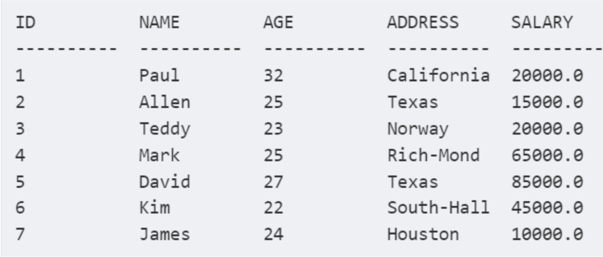
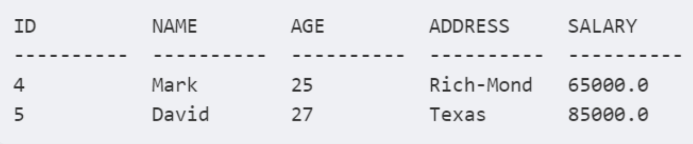

| **Цели занятия** |

-   Ознакомиться с вложенными запросами и их синтаксисом.
-   Ознакомиться с правилами написания вложенных запросов.
-   Рассмотреть примеры вложенных запросов.

 |
| **План занятия** |

-   Что такое вложенный запрос.
-   Правила написания подзапросов.
-   Синтаксис вложенного запроса.
-   Примеры вложенных запросов.

 |

* * * * *

Что такое вложенный запрос

**Вложенный запрос** (подзапрос или внутренний запрос) --- это запрос в другом запросе, встроенный в предложение `WHERE`.

Подзапрос используется для возврата данных, которые будут использоваться в основном запросе в качестве условия для дальнейшего ограничения данных, подлежащих извлечению.

Подзапросы могут использоваться с операторами `SELECT`, `INSERT`, `UPDATE` и `DELETE` вместе с такими операторами, как `=, <,>,> =, <=, IN, BETWEEN` и т. д.

Правила написания подзапросов

-   Подзапросы должны быть заключены в круглые скобки.
-   У подзапроса может быть только один столбец в предложении `SELECT`, если в основном запросе нет нескольких столбцов для подзапроса для сравнения его выбранных столбцов.
-   ORDER BY нельзя использовать в подзапросе, хотя основной запрос может использовать `ORDER BY`. `GROUP BY` может использоваться для выполнения той же функции, что и `ORDER BY` в подзапросе.
-   Подзапросы, которые возвращают более одной строки, могут использоваться только с несколькими операторами значений --- такими, как оператор `IN`.
-   Оператор `BETWEEN` не может использоваться с подзапросом.
-   Тем не менее `BETWEEN` можно использовать в подзапросе.

Синтаксис вложенного запроса

**Синтаксис вложенного запроса --- стандартный:**

SELECT column_name [, column_name ]
FROM table1 [, table2 ]
WHERE column_name OPERATOR
   (SELECT column_name [, column_name ]
      FROM table1 [, table2 ]
      [WHERE])

Начинается с `SELECT`, после него указываем поля, которые хотим увидеть в итоговом результате. После ключевого слова `FROM` указываем таблицу (таблицы). Затем идет условие `WHERE`, после которого мы указываем поле и `OPERATOR`. И за ними в круглых скобках идет сам вложенный запрос.

Допустим, у нас есть таблица с успеваемостью студентов и есть поле оценки за экзамен. Мы можем воспользоваться вложенным запросом, чтобы получить таблицу, которая будет содержать только тех студентов, у которых оценка максимальная. Для этого в подзапросе мы должны написать такое условие, которое будет возвращать эту максимальную оценку. И в столбце с оценкой мы накладываем условие, что оценка равна максимальной.

Примеры вложенных запросов

Рассмотрим вложенные запросы на примере таблицы с информацией о сотрудниках компании.

Давайте напишем запрос, который выберет сотрудников с зарплатой больше 45 тыс.

Сначала мы выбираем все поля в таблице, затем в WHERE накладываем ограничения на ID, которые мы хотим увидеть в итоговой таблице --- берем только тех сотрудников, у которых зарплата больше определенного значения.

SELECT *
   FROM COMPANY
   WHERE ID IN (SELECT ID
      FROM COMPANY
      WHERE SALARY > 45000);

В круглых скобках у нас идет подзапрос, результатом которого будут ID сотрудников с нужной зарплатой:

Подзапросы с оператором INSERT

Синтаксис аналогичен синтаксису с оператором `SELECT`:

INSERT INTO table_name [ (column1 [, column2 ]) ]
   SELECT [ *|column1 [, column2 ]
   FROM table1 [, table2 ]
   [ WHERE VALUE OPERATOR ]

Запрос, который выбирает записи из таблицы `COMPANY` и добавляет их в таблицу `COMPANY_BKP`:

INSERT INTO COMPANY_BKP
   SELECT * FROM COMPANY
   WHERE ID IN (SELECT ID
      FROM COMPANY);

Оператор `INSERT` использует данные, возвращенные из подзапроса, для вставки в другую таблицу. Выбранные данные в подзапросе могут быть изменены с помощью любой даты, символьной или числовой функции.

Подзапросы с оператором UPDATE

Подзапрос может использоваться вместе с оператором `UPDATE`:

UPDATE table
SET column_name = new_value
[ WHERE OPERATOR [ VALUE ]
   (SELECT COLUMN_NAME
      FROM TABLE_NAME)
   [ WHERE) ]

Можно использовать один или несколько столбцов в таблице при использовании подзапроса с оператором `UPDATE`.

Допустим, у нас есть таблица `COMPANY_COPY`, которая представляет собой резервную копию таблицы `COMPANY`. Мы хотим обновить значения поля `SALARY` в 1,5 раза для всех сотрудников, возраст которых больше или равен 30 годам:

UPDATE COMPANY
   SET SALARY = SALARY * 1.50
   WHERE AGE IN (SELECT AGE FROM COMPANY_COPY
      WHERE AGE >= 30);

Подзапросы с оператором DELETE

Подзапрос может использоваться вместе с оператором `DELETE`. Синтаксис аналогичен:

DELETE FROM TABLE_NAME
[ WHERE OPERATOR [ VALUE ]
   (SELECT COLUMN_NAME
      FROM TABLE_NAME)
   [ WHERE) ]

Допустим, что у нас есть все та же таблица `COMPANY_COPY`, которая является резервной копией таблицы `COMPANY`. В этом примере удаляются записи из таблицы `COMPANY` для всех клиентов, чей возраст больше или равен 30:

DELETE FROM COMPANY
   WHERE AGE IN (SELECT AGE FROM COMPANY_COPY
   WHERE AGE > 30);

В практической части видеоурока можно посмотреть примеры работы с вложенными запросами.

* * * * *

Итоги занятия:

-   Подзапрос используется для возврата данных, которые будут использоваться в основном запросе в качестве условия для дальнейшего ограничения данных, подлежащих извлечению.
-   Подзапросы могут использоваться с операторами `SELECT`, `INSERT`, `UPDATE` и `DELETE` вместе с такими операторами, как `=, <,>,> =, <=, IN, BETWEEN` и т. д.