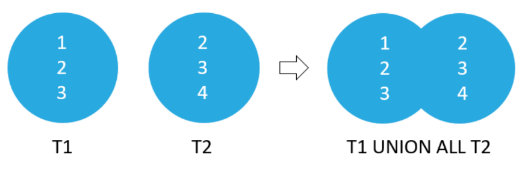

| **Цели занятия** |

-   Ознакомиться с объединением данных с помощью оператора UNION.
-   Ознакомиться с различиями операторов UNION и UNION ALL.
-   Рассмотреть примеры применения UNION.

 |
| **План занятия** |

-   В каких случаях может потребоваться объединение нескольких таблиц.
-   UNION.
-   Примеры применения UNION.

 |

* * * * *

В каких случаях может потребоваться объединение нескольких таблиц

Например, у нас есть таблицы с метеорологическими данными за 10 лет. В каждой таблице хранятся результаты измерений за определенный год. При этом таблицы имеют одинаковую структуру, то есть одинаковый набор полей и их тип.

Мы хотим объединить данные из этих десяти таблиц в одну итоговую, которая будет представлять собой результаты наблюдений погоды за 10 лет.

Как раз для решения подобных задач требуется оператор `UNION`.

UNION

Оператор языка SQL UNION предназначен для объединения результирующих таблиц базы данных, полученных с применением SELECT-запроса.

В этом примере мы объединяем результаты выполнения трех запросов, каждый из которых должен возвращать таблицу одной и той же структуры. То есть таблица первого запроса имеет ту же структуру, что и таблица второго и третьего запросов.

**Правила для запросов, когда мы объединяем их с помощью UNION:**

-   Число столбцов во всех запросах должно быть одинаковым.
-   Столбцы должны иметь одинаковый тип.
-   Название полей в итоговом результате берется из названий полей первого запроса.

Отличие UNION и UNION ALL

Рассмотрим простой пример.

Мы сначала создаем таблицу из одного единственного поля типа `INT` и заполняем значениями --- 1, 2, 3. Затем создаем вторую таблицу с такой же структурой --- одно поле типа `INT`. Заполняем ее значениями --- 2, 3, 4.

Далее объединяем созданные таблицы с помощью `UNION`:

Первый запрос выбирает все данные из первой таблицы, затем идет оператор `UNION`, и за ним второй запрос, который выбирает все данные из второй таблицы.

В результате объединения у нас получится таблица со значениями 1, 2, 3, 4.

Значения 1 и 4 содержатся только в одной таблице, значения 2 и 3 --- в обоих. Так как мы применили оператор `UNION`, то получили результат без дублирующихся значений. Это важное отличие `UNION` от `UNION ALL`.

Если бы мы использовали `UNION ALL`, то получили бы дубликаты:

Запрос с применением `UNION ALL` работает быстрее, но могут получиться дубликаты. Применение оператора `UNION` позволяет убрать дублирующиеся значения, но время выполнения будет больше.

Примеры применения UNION

Из таблицы с сотрудниками выбираем имя и фамилию сотрудника и добавляем новое поле под названием `Type`, которое из строк таблицы с сотрудниками равно значению `'Employee'`.

Затем из второй таблицы заказчиков выбираем те же поля --- имя и фамилия. А затем добавляем новое поле, но уже со значением `'Customer'`. И объединяем результаты выполнения этих двух запросов:

SELECT FirstName, LastName, 'Employee' AS Type
FROM employees
UNION
SELECT FirstName, LastName, 'Customer'
FROM customers
ORDER BY FirstName, LastName;

В итоговой таблице у нас будет имя, фамилия и информация о том, кем является человек --- сотрудником (Employee) или заказчиком (Customer)

Практические примеры применения оператора UNION можно посмотреть в видео к уроку.

* * * * *

Итоги занятия:

-   В языке SQL операция `UNION` применяется для объединения наборов строк, возвращаемых SQL-запросами. Запросы должны возвращать одинаковое число столбцов, и столбцы с одинаковым порядковым номером должны иметь совместимые типы данных.
-   При использовании `UNION` дубликаты строк в итоговом результате удаляются, а при `UNION ALL` --- нет. В связи с этим `UNION ALL` работает быстрее.

Some problems have options such as save, reset, hints, or show answer. These options follow the Submit button.

Источники

1.  <https://ylianova.ru/raznoe-2/chto-takoe-relyaczionnye-bazy-dannyh-chto-takoe-relyaczionnaya-baza-dannyh.html>
2.  <https://infourok.ru/kratkiy-kurs-lekciy-po-discipline-osnovi-proektirovaniya-baz-dannih-2660932.html>
3.  <https://multiurok.ru/files/lektsii-po-bazam-dannykh.html>
4.  <https://aa.al-shell.ru/articles/chast-realnogo-mira-podlezhaschaya-avtomatizatsii/>
5.  <https://nsportal.ru/npo-spo/informatika-i-vychislitelnaya-tekhnika/library/2017/10/19/konspekt-lektsiy-osnovy>
6.  <https://studopedia.net/3_11528_INSERT-INTO-Abonent-AccountCD-StreetCD-HouseNO-FlatNO-Fio-Phone.html>