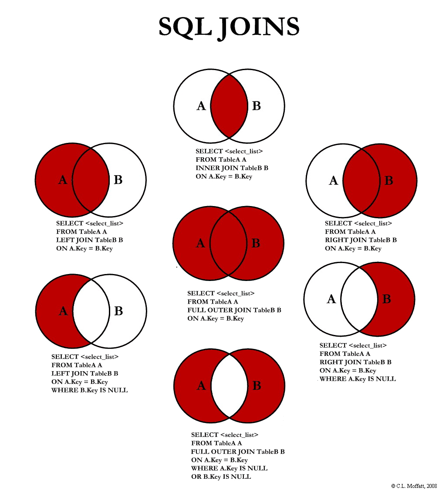
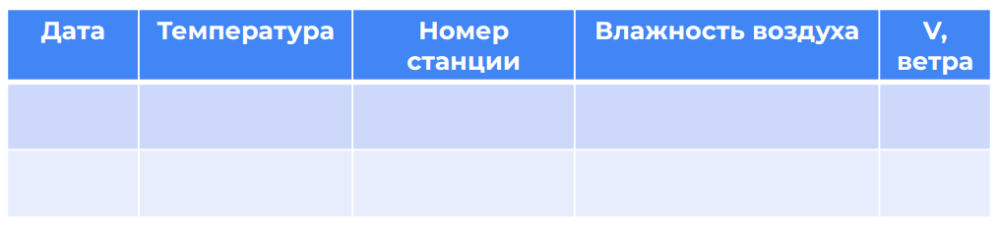

| **Цели занятия** |

-   Узнать, какие типы объединений таблиц существуют и какой тип в каком случае использовать.
-   Ознакомиться с написанием запросов для объединения таблиц.

 |
| **План занятия** |

-   Типы джойнов.
-   Примеры использования джойнов LEFT и RIGHT.

 |

* * * * *

Типы джойнов

На рисунке показаны объединения таблиц с помощью множеств:

[Источник](https://www.programmersought.com/article/6034137130/)

Под множеством A подразумевается таблица слева, а под множеством B --- таблица справа.

Основные типы джойнов:

-   `LEFT JOIN` --- мы берем все элементы из таблицы А и элементы из В, которые есть в А.
-   `INNER JOIN` --- возвращает пересечения множеств, то есть в итоговой таблице будут только те строки, которые находятся и в таблице А, и в таблице В.
-   `RIGHT JOIN` аналогичен `LEFT JOIN`, только в исходной таблице содержатся все элементы из множества B, а из А взяты только те строки, которые есть в В.
-   `FULL OUTER JOIN` объединяет все строки из таблиц А и В.

Также с помощью условия `WHERE` задается так называемая симметрическая разность. Это когда в итоговой таблице мы получаем только те строки, которые отсутствуют в обеих таблицах.

Еще один пример тоже с использованием условия `WHERE`, когда в итоговой таблице мы получаем те строки из таблицы А или из таблицы В, которые отсутствуют в другой таблице.

Примеры использования джойнов LEFT и RIGHT

Допустим, у нас есть метеорологические данные, которые представлены двумя таблицами:

В первой таблице у нас содержится информация о дате наблюдения, температуре и других метеорологических параметрах. Также у нас есть номер станции, на которой сняты наблюдения.

Вторая таблица содержит информацию по станциям --- номер, расположение и какую-то другую информацию, которая привязана к станции, а не к наблюдению.

Нам потребуется `LEFT JOIN`, если мы хотим получить таблицу, в которой будет информация и о наблюдениях, и о географических координатах станций.

Структура запроса на объединение таблиц

SELECT <список полей таблицы>
FROM <Таблица1>
LEFT JOIN <Таблица2>
ON <Таблица1>. <поле, по которому объединяем>=<Таблица2>.<поле, по которому объединяем>;

В примере с помощью `INNER JOIN` мы объединяем таблицы по заказам и по покупателям:

SELECT Orders.OrderID, Customers.CustomerName, Orders.OrderDate
FROM Orders
INNER JOIN Customers
ON Orders.CustomerID=Customers.CustomerID;

В итоге получаем таблицу, в которой будут только те клиенты, которые есть и в таблице с заказами, и в таблице с покупателями. Другими словами, находим пересечения двух таблиц.

В практической части видеоурока можно посмотреть примеры объединения таблиц.

* * * * *

Итоги занятия:

-   Для получения данных из двух и более таблиц требуется применение джойнов.
-   Основные типы джойнов: `INNER`, `OUTER`, `LEFT`, `RIGHT`.
-   `INNER JOIN` возвращает внутреннее пересечение таблиц по какому-либо критерию.
-   `FULL OUTER JOIN` возвращает не только строгое пересечение между двумя таблицами, но также отдельные элементы, которые принадлежат только одному из множеств.
-   `LEFT JOIN` возвращает пересечение множеств и все элементы из левой таблицы.
-   `RIGHT JOIN` аналогичен `LEFT JOIN`, только вместо левой таблицы --- правая.