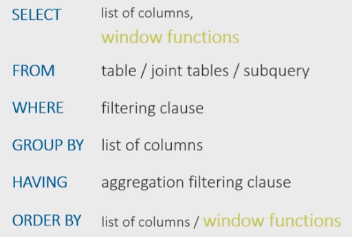
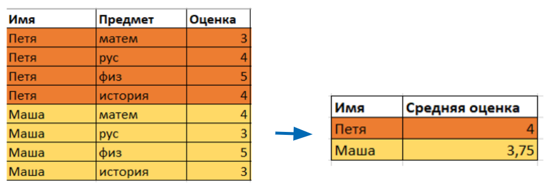
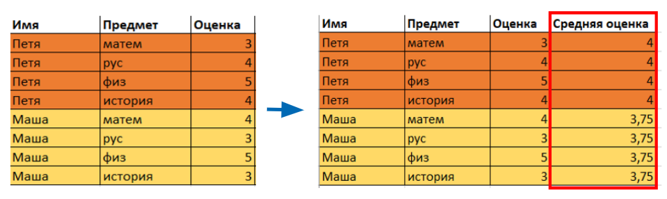
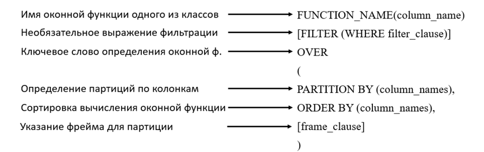
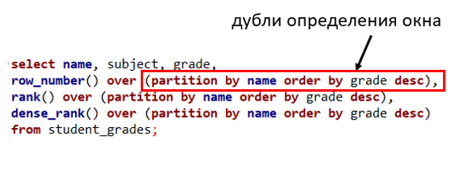
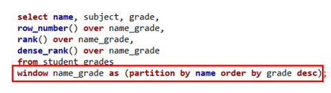

Что такое оконная функция

**Оконная функция в SQL** --- функция, которая работает с выделенным набором строк (окном, партицией) и выполняет вычисление только для этого набора строк. Результаты вычислений записываются в отдельном столбце.

**Партиции (окна из набора строк)** --- это набор строк, указанный для оконной функции по одному из столбцов или группе столбцов таблицы.

Оконные функции не изменяют саму исходную выборку, а только добавляют дополнительную информацию о выборке. То есть сначала выполняется основной запрос, а уже потом рассчитывается значение окна.

Синтаксис оконных функций

Оконную функцию можно указать после перечисления столбцов, которые мы хотим увидеть в итоговой таблице. То есть после `SELECT` мы перечисляем столбцы, а затем идет оконная функция.

Далее идет стандартное указание таблицы, из которой делаем выборку, выполнение подзапроса или объединение таблиц, если мы хотим применить оконную функцию к результату объединения таблиц. Затем идет условие `WHERE`, которое выполняет фильтрацию строк таблицы, За ним следует оператор `GROUP BY`, за которым мы перечисляем столбцы для группировки.

Если нам необходимо сделать фильтрацию строк по рассчитанным агрегатным значениям, то добавляем условие `HAVING`. И в конце стоит оператор `ORDER BY`, в котором мы указываем, по каким столбцам выполняем сортировку.

Также мы можем указать оконную функцию после оператора **ORDER BY**.

Оконные функции VS GROUP BY

Рассмотрим отличие оконных функций от `GROUP BY` на примере. Допустим, у нас есть таблица с успеваемостью студентов. Если мы будем использовать оператор `GROUP BY` для расчета средней оценки по студентам, то в итоговой таблице получим всего две строки. То есть из-за группировки мы получим меньшее количество строк.

Оконная функция вернет нам для каждой входящей строки одинаковые значения в новом столбце, а количество строк останется прежним.

Рассмотрим подробнее синтаксис оконной функции:

А вот два равнозначных примера использования оконной функции, разница лишь в их расположении:

Типы оконных функций

Оконные функции бывают нескольких типов:

-   Агрегатные (агрегирующие).
-   Ранжирующие.
-   Функции смещения.
-   Аналитические.

В одном запросе мы можем использовать сразу несколько оконных функций.

* * * * *

Итоги занятия:

-   Оконные функции позволяют применять преобразования к определенным группам строк.
-   Выделяют следующие типы оконных функций: агрегатные, ранжирующие, функции смещения и аналитические функции.
-   При использовании агрегирующих функций предложение `GROUP BY` сокращает количество строк в запросе с помощью их группировки.
-   При использовании оконных функций количество строк в запросе не уменьшается по сравнению с исходной таблицей.

Источники

-   [Оконные функции в SQL --- что это и зачем они нужны](https://tproger.ru/translations/sql-window-functions/)
-   [Полезные оконные функции SQL](https://vc.ru/dev/130856-poleznye-okonnye-funkcii-sql)
-   [Оконные функции с «форточкой» или как пользоваться фреймом](https://habr.com/ru/company/otus/blog/490296/)
-   [Полезные оконные функции SQL](https://newtechaudit.ru/okonnye-funkczii-sql/)
-   [Оконные функции SQL простым языком с примерами](https://www.pvsm.ru/bazy-danny-h/374701)