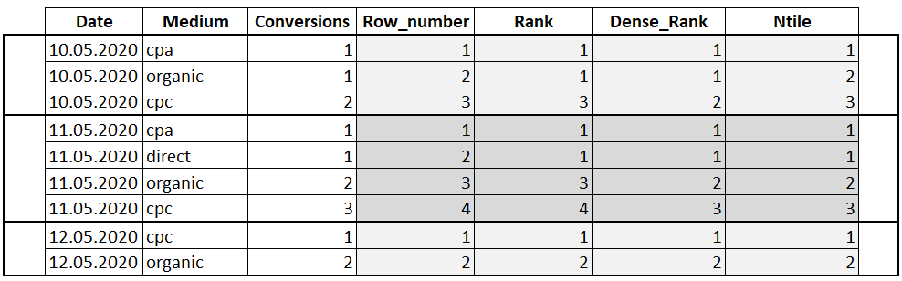

| **Цели занятия** |

-   Ознакомиться с ранжирующими оконными функциями.
-   Рассмотреть примеры ранжирующих оконных функций.

 |
| **План занятия** |

-   Что такое ранжирующие функции.
-   Примеры.

 |

* * * * *

Ранжирующие функции

**Ранжирующие функции** --- это функции, которые ранжируют значение для каждой строки в окне. Например, их можно использовать, чтобы присвоить порядковый номер строке или составить рейтинг.

**Виды ранжирующих функций:**

-   `ROW_NUMBER` --- функция возвращает номер строки и используется для нумерации.
-   `RANK` --- функция возвращает ранг каждой строки. Значения уже анализируются, и в случае нахождения одинаковых, функция возвращает одинаковый ранг с пропуском следующего значения.
-   `DENSE_RANK` --- функция возвращает ранг каждой строки. Но в отличие от функции RANK, она для одинаковых значений возвращает ранг, не пропуская следующий.
-   `NTILE` --- это функция, которая позволяет определить, к какой группе относится текущая строка. Количество групп задается в скобках.

Пример ранжирующих функций

В качестве примера возьмем таблицу с конверсиями разных маркетинговых каналов, которую мы рассматривали на прошлом занятии.


Сделаем запрос с использованием ранжирующих функций в разрезе дат:

```
SELECT Date, Medium, Conversions, ROW_NUMBER() OVER(PARTITION BY Date
ORDER BY Conversions) AS 'Row_number',
RANK() OVER(PARTITION BY Date ORDER BY Conversions) AS 'Rank' , DENSE_RANK() OVER(PARTITION BY Date ORDER BY Conversions) AS 'Dense_Rank' ,
NTILE(3) OVER(PARTITION BY Date ORDER BY Conversions) AS 'Ntile'
FROM Orders
```

В результате получаем такую таблицу:




* * * * *

Итоги занятия:

-   Ранжирующие функции позволяют ранжировать значение для каждой строки в окне. Часто их применяют, когда нужно присвоить порядковый номер строке или составить рейтинг.
-   К ранжирующим функциям относятся `ROW_NUMBER`, `RANK`, `DENSE_RANK` и `NTILE`.
-   Для нумерации строк есть функция `ROW_NUMBER`.
-   При ранжировании строк используются функции `RANK`, `DENSE_RANK`.
-   Для определения, к какой группе относится текущая строка, есть функция `NTILE`.

Источники

-   [Учимся применять оконные функции](https://thisisdata.ru/blog/uchimsya-primenyat-okonnyye-funktsii/)