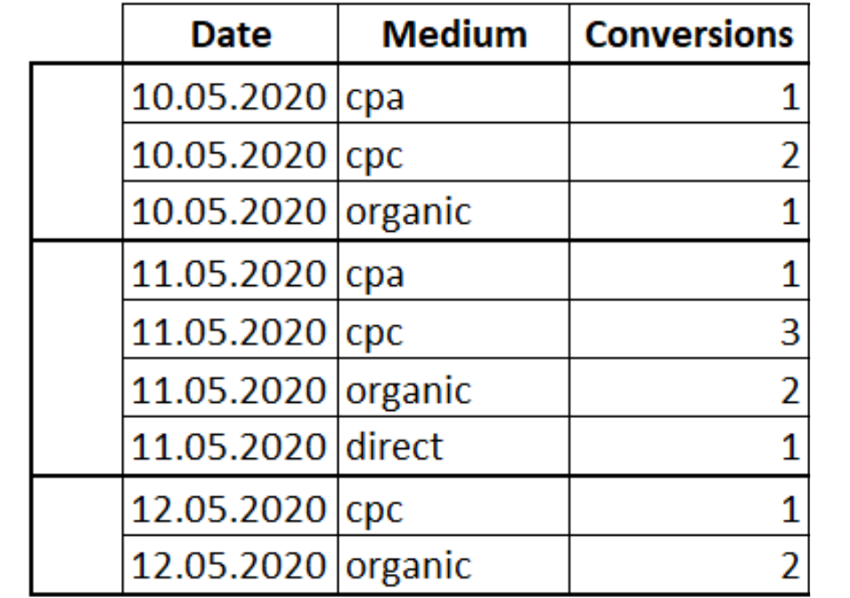
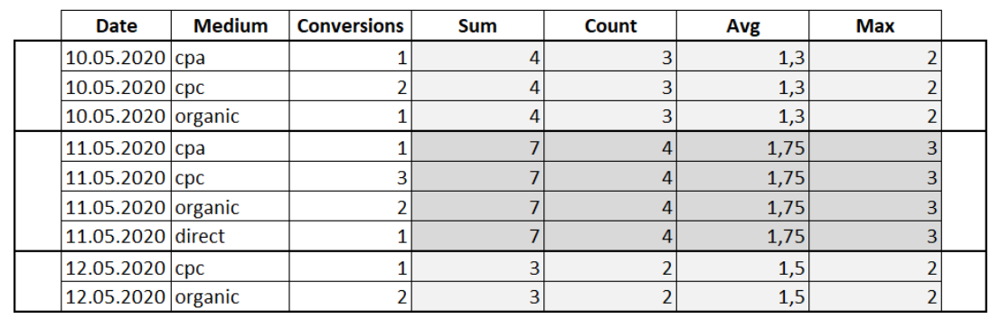

| **Цели занятия** |

-   Ознакомиться с применением агрегирующих оконных функций.
-   Рассмотреть примеры с агрегирующими оконными функциями.

 |
| **План занятия** |

-   Агрегирующие оконные функции.
-   Примеры.

 |

* * * * *

Агрегирующие оконные функции

**Агрегирующие (агрегатные) оконные функции** --- это функции, которые выполняют вычисления на наборе данных арифметические и возвращают итоговое значение.

К агрегирующим функциям относятся:

-   `COUNT` --- вычисляет количество значений в столбце (значения `NULL` не учитываются).
-   `AVG` --- определяет среднее значение в столбце.
-   `MAX` --- определяет максимальное значение в столбце.
-   `MIN` --- определяет минимальное значение в столбце.

Агрегирующие функции похожи на функции группировки, но вместо применения к группам применяются к окнам, которые определены после ключевого слова `OVER`.

Пример агрегирующих оконных функций

Допустим, у нас есть таблица, которая содержит информацию о дате прихода пользователя по тому или иному маркетинговому каналу. Также у нас есть столбец с информацией о том, по какому маркетинговому каналу пришел пользователь. Есть еще один столбец с конверсией, то есть сколько пользователей совершило целевое действие.

Применим агрегатные функции к окнам в разрезе дат:

SELECT Date, Medium, Conversions,
SUM(Conversions) OVER(PARTITION BY Date) AS 'Sum', COUNT(Conversions) OVER(PARTITION BY Date) AS 'Count', AVG(Conversions) OVER(PARTITION BY Date) AS 'Avg',
MAX(Conversions) OVER(PARTITION BY Date) AS 'Max',
MIN(Conversions) OVER(PARTITION BY Date) AS 'Min'
FROM Orders

В результате к исходной таблице добавились столбцы с расчетом агрегатных функций.

В практической части видеолекции можно посмотреть пример работы с агрегатными функциями.

* * * * *

Итоги занятия:

-   Оконные функции агрегирования представляют собой то же, что и агрегатные функции группировки, но вместо применения к группам в групповых запросах они применяются к окнам, определяемых в предложении `OVER`.
-   Функция агрегирования должна применяться к наборам строк.

Источники

-   [Учимся применять оконные функции](https://thisisdata.ru/blog/uchimsya-primenyat-okonnyye-funktsii/)