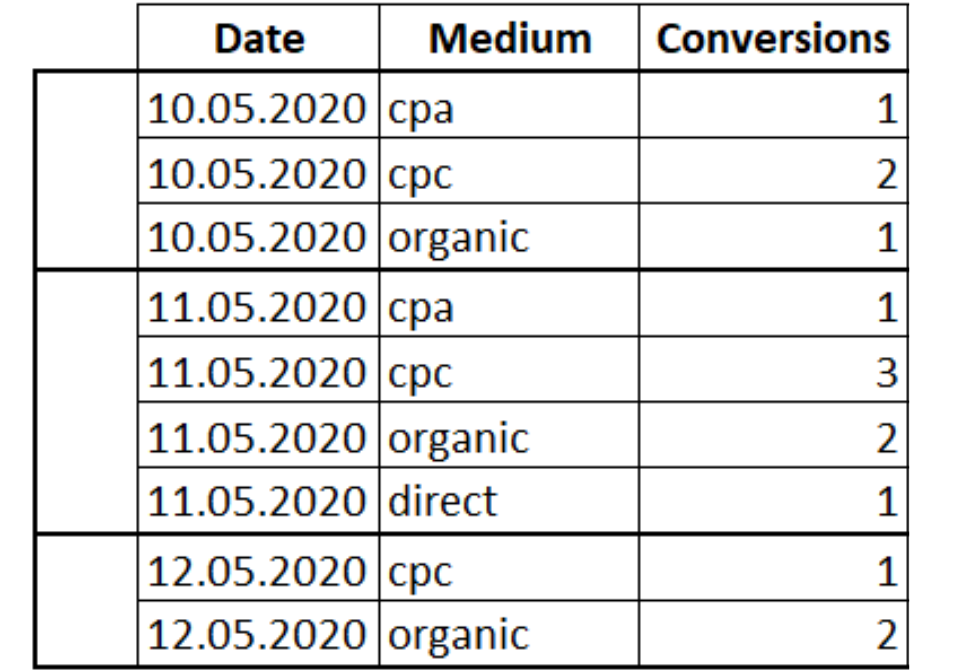

| **Цели занятия** |

-   Ознакомиться с функциями смещения.
-   Рассмотреть примеры использования функций смещения.

 |
| **План занятия** |

-   Что такое функции смещения.
-   Примеры.

 |

* * * * *

Что такое функция смещения

**Функции смещения** --- это функции, которые позволяют перемещаться и обращаться к разным строкам в окне относительно текущей строки. А также обращаться к значениям в начале или в конце окна.

На занятии рассмотрим четыре основных функции смещения:

-   `LAG` или `LEAD`. Функция `LAG` обращается к данным из предыдущей строки окна, а `LEAD` --- к данным из следующей строки.
-   `FIRST_VALUE` или `LAST_VALUE` --- с помощью функции можно получить первое и последнее значение в окне. В качестве параметра принимает столбец, значение которого необходимо вернуть.

У этих функций есть три параметра:

-   столбец, значение которого необходимо вернуть;
-   количество строк для смещения;
-   значение, которое необходимо вернуть, если по каким-то причинам возвращается пропуск.

Пример функций смещения

Чтобы рассмотреть работу функций смещения, возьмем ту же таблицу с конверсиями разных маркетинговых каналов.



Сделаем запрос:

```
SELECT Date, Medium, Conversions,
LAG(Conversions) OVER(PARTITION BY Date ORDER BY Date) AS 'Lag', LEAD(Conversions) OVER(PARTITION BY Date ORDER BY Date) AS 'Lead', FIRST_VALUE(Conversions) OVER(PARTITION BY Date ORDER BY Date) AS 'First_Value',
LAST_VALUE(Conversions) OVER(PARTITION BY Date ORDER BY Date) AS 'Last_Value'
FROM Orders
```

Результат:


* * * * *

Итоги занятия:

-   Функции смещения позволяют перемещаться и обращаться к разным строкам в окне относительно текущей строки. А также обращаться к значениям в начале или в конце окна.
-   Основные функции смещения: `LAG` или `LEAD`, `FIRST_VALUE` или `LAST_VALUE`.

Источники

-   [Учимся применять оконные функции](https://thisisdata.ru/blog/uchimsya-primenyat-okonnyye-funktsii/)