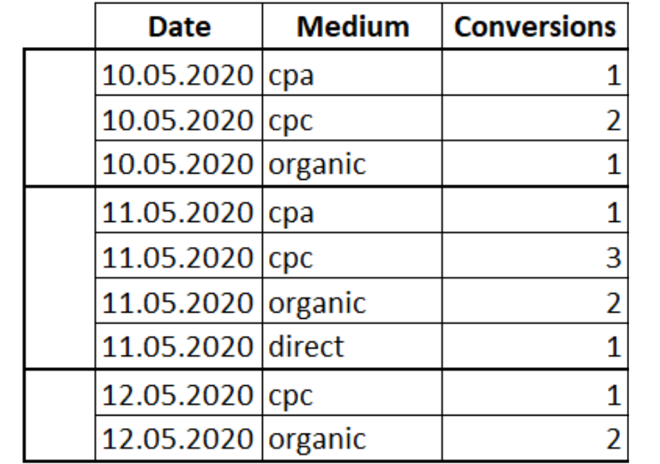
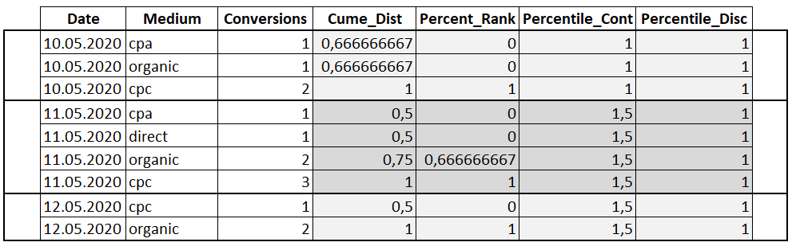

| **Цели занятия** |

-   Ознакомиться с аналитическими функциями.
-   Рассмотреть примеры применения аналитических функций.

 |
| **План занятия** |

-   Что такое аналитические функции.
-   Примеры.

 |

* * * * *

Аналитические функции

**Аналитические функции** --- это функции, которые возвращают информацию о распределении данных и используются для статистического анализа.

Типы аналитических функций:

-   `CUME_DIST` --- вычисляет интегральное распределение (относительное положение) значений в окне.
-   `PERCENT_RANK` --- вычисляет относительный ранг строки в окне.
-   `PERCENTILE_CONT` --- вычисляет процентиль на основе постоянного распределения значения столбца. В качестве параметра принимает процентиль, который необходимо вычислить.
-   `PERCENTILE_DISC` --- вычисляет определенный процентиль для отсортированных значений в наборе данных. В качестве параметра принимает процентиль, который необходимо вычислить.

Примеры

Вернемся к нашей таблице конверсий для разных маркетинговых каналов.



Создадим запрос:
```
SELECT Date, Medium, Conversions,
CUME_DIST() OVER(PARTITION BY Date ORDER BY Conversions) AS 'Cume_Dist',
PERCENT_RANK() OVER(PARTITION BY Date ORDER BY Conversions) AS 'Percent_Rank',
PERCENTILE_CONT(0.5) WITHIN GROUP (ORDER BY Conversions) OVER(PARTITION BY Date) AS 'Percentile_Cont',
PERCENTILE_DISC(0.5) WITHIN GROUP (ORDER BY Conversions) OVER(PARTITION BY Date) AS 'Percentile_Disc'
FROM Orders
```
Результат:




* * * * *

Итоги занятия:

-   Аналитические функции возвращают информацию о распределении данных и используются для статистического анализа.
-   Интегральное распределение (относительное положение) значений в окне можно вычислить с помощью функции `CUME_DIST`.

Источники

-   [Учимся применять оконные функции](https://thisisdata.ru/blog/uchimsya-primenyat-okonnyye-funktsii/)