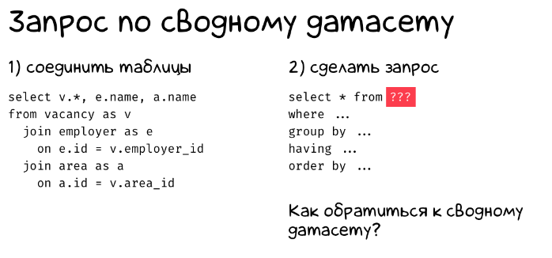

| **Цели занятия** |

-   Рассмотреть, в каких случаях пригодятся временные таблицы.
-   Ознакомиться со способами работы с промежуточными результатами.
-   Рассмотреть примеры работы с промежуточными данными, которые не нужно сохранять.

 |
| **План занятия** |

-   Что такое табличное выражение, представление и временные таблицы.
-   В каких случаях могут пригодиться временные таблицы.

 |

* * * * *

В каких случаях пригодятся временные таблицы

Допустим, у нас есть две больших таблицы в базе данных, и нам нужно написать запрос к результату их объединения. Создавать еще одну таблицу для хранения мы бы не хотели.



Как запускать запросы по сводным данным:

-   Табличное выражение (CTE).
-   Представление (view).
-   Временная таблица (temporary table).

Рассмотрим подробнее каждый из вариантов.

Табличное выражение (CTE)

**Табличное выражение** --- это подзапрос с именем.

Синтаксис:
```
with combined_cte as (
  select v.*, e.name, a.name
  from vacancy as v
    join employer as e on e.id = v.employer_id
    join area as a on a.id = v.area_id
)
select ...
from combined_cte
where ...
group by ...
order by ...
```
Представление (view)

**Представление** --- это виртуальная таблица, содержимое которой определяется запросом. Представление работает как CTE, но к нему можно обращаться как к обычной таблице, и при этом не повторять каждый раз подзапрос.

Синтаксис:

-- 1) create once
```
create view combined_view as
select v.*, e.name, a.name
from vacancy as v
  join employer as e on e.id = v.employer_id
  join area as a on a.id = v.area_id;
```
-- 2) use everywhere
```
select ...
from combined_view
where ...
group by ...
order by ...
```
Временная таблица (temporary table)

**Временная таблица** --- это объект базы данных, который хранится и управляется системой базы данных на временной основе. Временные таблицы существуют только пока открыто соединение с базой данных.

Временные таблицы будут подходящим вариантом, если вы хотите поэкспериментировать с данными, и для этого вам нужны промежуточные результаты. При этом у вас большое количество объемных таблиц, и вы хотите соединить их различными способами, но не планируете хранить промежуточные данные.

Синтаксис:

-- 1) create once
```
create temp table combined_temp as
select v.*, e.name, a.name
from vacancy as v
  join employer as e on e.id = v.employer_id
  join area as a on a.id = v.area_id;
```
-- 2) use everywhere
```
select ...
from combined_temp
where ...
group by ...
order by ...
```
* * * * *

Итоги занятия:

-   Для хранения промежуточных данных можно использовать табличное выражение (CTE), представление (view) или временную таблицу (temporary table).
-   Табличное выражение можно представить как подзапрос с именем.

Источники

-   [Типы таблиц в PostgreSQL: logged, unlogged и temporary tables](https://habr.com/ru/company/quadcode/blog/679616/)
-   [Временные таблицы в SQLite](https://antonz.ru/temp-tables/)
-   [Временные таблицы](https://metanit.com/sql/sqlserver/10.4.php)
-   [Подзапросы и временные таблицы](https://professorweb.ru/my/sql-server/2012/level2/2_11.php)