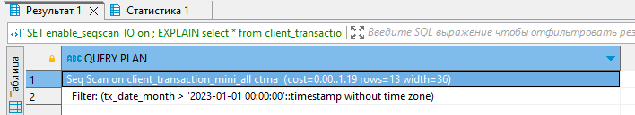
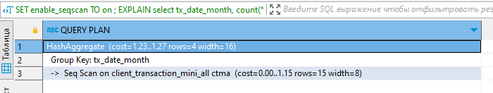
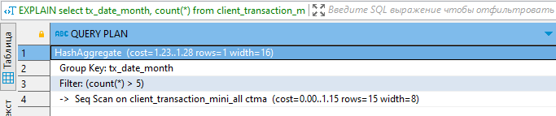
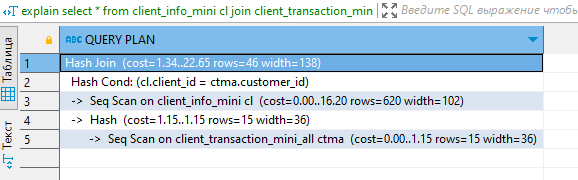
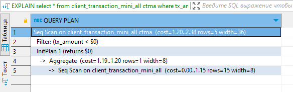
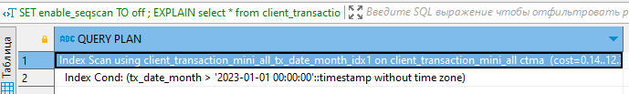

| **Цели занятия** |

-   Ознакомиться с тем, что такое план запроса и для чего он нужен.
-   Узнать, как можно посмотреть план выполнения запроса.

 |
| **План занятия** |

-   Что такое план запроса.
-   Как можно посмотреть план запроса.

 |

* * * * *

Что такое план запроса

**План запроса** --- последовательность операций, необходимых для получения результата SQL-запроса в реляционной СУБД.

`EXPLAIN` --- команда в PostgreSQL для просмотра плана выполнения.

`EXPLAIN [ ( option [, ...] ) ] statement`, где `statement` --- сам запрос, а `option` может принимать одно из значений:

 ANALYZE [boolean]
 VERBOSE [boolean]
 COSTS [boolean]
 SETTINGS [boolean]
 GENERIC_PLAN [boolean]
 BUFFERS [boolean]
 WAL [boolean]
 TIMING [boolean]
 SUMMARY [boolean]
 FORMAT { TEXT | XML | JSON | YAML }

**Типы планов:**

-   `EXPLAIN` --- тип плана, с которого все начинают, выводит минимальную информацию и сам план запроса.
-   `EXPLAIN ANALYSE` --- тип плана, который используется для выполнения запроса, наряду с получением плана запроса. Таким образом мы получаем разбивку по времени планирования и времени выполнения.
-   `EXPLAIN (ANALYSE, BUFFERS)` --- тип плана, который используется поверх анализа для получения числа строк, читаемых из кэша и диска.
-   `EXPLAIN (ANALYSE, BUFFERS, VERBOSE)` --- тип плана для получения более подробной и дополнительной информации по запросу
-   `EXPLAIN(ANALYSE,BUFFERS,VERBOSE,FORMAT JSON)` --- тип плана, который выводит план в нужном формате, в данном случае --- JSON.

Примеры

**С оператором `where`:**
```
EXPLAIN
select *
from client_transaction_mini_all ctma
where tx_date_month > '2023-01-01'::timestamp
```


**С оператором `group by`:**
```
EXPLAIN
select tx_date_month, count(*)
from client_transaction_mini_all ctma
group by tx_date_month
```


**С `having` при группировке:**
```
EXPLAIN
select tx_date_month, count(*)
from client_transaction_mini_all ctma
group by tx_date_month
having count(*) > 5
```


**Объединение таблиц:**
```
EXPLAIN
select *
from client_info_mini cl
join client_transaction_mini_all ctma on cl.client_id = ctma.customer_id
```


**Подзапрос:**
```
EXPLAIN
select *
from client_transaction_mini_all ctma
where tx_amount < (select max(tx_amount) from client_transaction_mini_all)
```


Теперь добавим к таблице индекс, и в результате получим другой план выполнения запроса:
```
CREATE INDEX ON client_transaction_mini_all(tx_date_month);
SET enable_seqscan TO off ;
EXPLAIN
select *
from client_transaction_mini_all ctma
where tx_date_month > '2023-01-01'::timestamp
```


В случае сложных запросов просмотр плана запросов будет полезен для поиска путей оптимизации уже написанного запроса и в целом для представления, в какой последовательности будут выполняться операции.


* * * * *

Итоги занятия:

-   Просмотр плана выполнения запроса нужен для выяснения порядка выполнения «шагов» SQL-запроса.
-   Информация относительно плана выполнения запроса может быть использована для оптимизации запроса.