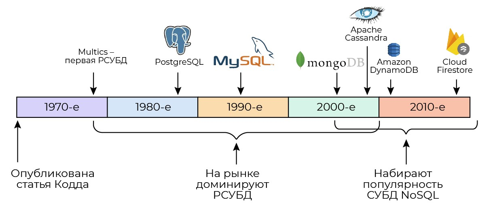
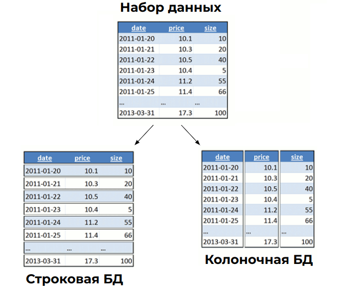
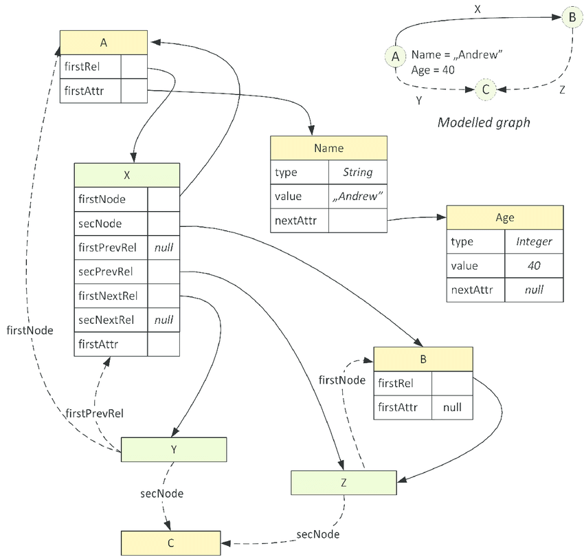
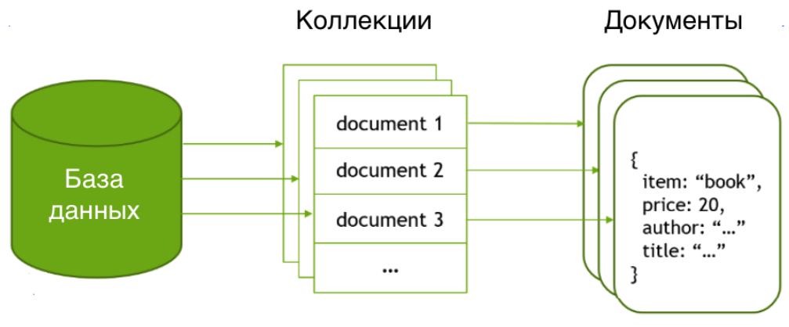

| **Цель занятия** | Ознакомиться с концепцией нереляционных баз данных и некоторыми сценариями их использования. |
---                     ---
| **План занятия** |

-   Почему реляционные БД --- не всегда оптимальный выбор? От SQL к NoSQL.
-   Некоторые сценарии применения NoSQL.

* * * * *

От SQL к NoSQL

Реляционные СУБД заняли доминирующую позицию на рынке еще в 1980-х гг., вытеснив иерархические и сетевые системы. Они остаются актуальным инструментом управления данными и по сей день в силу своей устойчивости к ошибкам и понятности языка запросов.

Источник: [cockroachlabs.com](https://www.cockroachlabs.com/blog/history-of-databases-distributed-sql/)

Однако к концу 2000-х годов в отрасли произошел ряд перемен, побудивших разработчиков экспериментировать с альтернативными моделями данных. Резко подешевело оборудование, из-за чего исчезла строгая необходимость в дедубликации данных. Данные, в свою очередь, становились все более разнообразными, и подгонять их под реляционную модель для хранения было часто нецелесообразно. Так возникла концепция NoSQL --- not only SQL.

В целом, NoSQL --- это зонтичная категория, под которую подпадают любые системы хранения данных, не соответствующие «каноническому» реляционному подходу. Вместо этого в них используются различные модели данных, такие как модель документа, ключ-значение, графы и колонки и т. д. Их объединяет то, что в них отсутствуют строгие требования нормализации, не считается ошибкой дублирование данных, а структура данных может быть весьма гибкой.

Ниже приведены некоторые общие характеристики NoSQL:

1.  **Гибкость данных.** Базы данных NoSQL позволяют хранить данные различных типов и структур, что делает их более гибкими и адаптивными к изменяющимся требованиям приложений.
2.  **Масштабируемость и распределенность.** Базы данных NoSQL могут масштабироваться горизонтально, т. е. позволяют добавлять дополнительные узлы в кластер, чтобы увеличивать производительность и обеспечивать отказоустойчивость.
3.  **Высокая производительность.** Базы данных NoSQL обычно имеют более высокую производительность, чем реляционные базы данных, особенно при работе с большими объемами данных.

Разумеется, характеристики решений NoSQL могут различаться в зависимости от конкретной реализации базы данных. Рынок NoSQL довольно разнообразен, поэтому при выборе СУБД стоит заранее оценить доступные решения исходя из предпочтительной модели данных.

Некоторые сценарии применения NoSQL

Нереляционные базы данных находят применение там, где нормализация вызывает проблемы производительности (подумайте, сколько ресурсов нужно для операции JOIN с десятками таблиц!) или вынуждает разработчика необоснованно тратить время на написание длинных запросов без видимого экономического эффекта.

Перечислим некоторые из сценариев.

**Колоночные БД** хранят данные не в таблицах, а в столбцах, причем каждый столбец хранится непрерывно, т. е. в последовательных блоках на диске. Главное преимущество такого подхода --- быстрое агрегирование данных, поэтому такие БД применяют для аналитики больших объемов данных.

Источник: [timestored.com](http://www.timestored.com/data/what-is-a-column-oriented-database)

Представьте, какие объемы данных нужно прочитать, когда выполняется вычисление средней цены для всех дат. В колоночной базе цены хранятся как один столбец, и мы можем читать только его. Поэтому такие базы данных чрезвычайно быстро выполняют агрегатные запросы (т. е. вычисление суммы, среднего и т. д.).

Недостаток этого подхода проявляется в случае, если нужно вставить запись куда-то в середину столбца. К счастью, если мы имеем дело с временными рядами, новые данные добавляются только в конец нашего набора данных.

**Графовые БД** основаны на модели данных в виде графа. В этой модели основными элементами являются узлы и связи между ними. Такие системы применяются для моделирования социальных графов в биоинформатике и в семантических сетях.

Источник: [cockroachlabs.com](https://www.cockroachlabs.com/blog/history-of-databases-distributed-sql/)

**Документоориентированные базы данных** хранят данные в виде «документов», обычно это структуры JSON. Содержимое документа может иметь гибкий набор свойств, поэтому такие структуры удобно использовать для создания библиотечных каталогов, блогов, платформ видеостриминга и других решений, где заранее невозможно построить четкую схему данных.

* * * * *

Итоги занятия:

-   Отличие нереляционных БД (NoSQL) от реляционных заключается в том, что они хранят данные не в виде таблиц, а в виде произвольных структур: колонок, графов, документов.
-   В общем случае в БД NoSQL отсутствуют строгие требования к нормализации данных и допускается дублирование данных.
-   В качестве преимуществ решений NoSQL производители обычно заявляют гибкость данных, масштабируемость и производительность, однако выбор решения будет зависеть от конкретного сценария применения и требует тщательного подхода.

---

### Рефлексия

Некоторые разработчики считают, что использование NoSQL — это нерадивый подход к хранению данных. Приведите несколько аргументов, объясняющих, почему в определенных сценариях нереляционный подход выигрывает.

Безусловно, концепция NoSQL возникла во многом из соображений экономии труда: под конец 2000-х гг. именно труд разработчика (а не стоимость хранения информации и вычислений) стал основной статьей расходов при разработке программных продуктов. В этом смысле применение упрощенных подходов к программированию и хранению информации действительно можно считать нерадивой стратегией с технической точки зрения. Однако в коммерческой разработке главная цель — получить работоспособный продукт при текущих ресурсах.

Не стоит упускать и технические преимущества нереляционных БД: многие из этих систем являются изначально горизонтально масштабируемыми (т. е. БД может быть расширена на несколько серверов для обработки больших объемов данных и повышения производительности), тогда как реляционные БД требуют для этого специальной настройки.

Чем более разнообразными становятся сценарии применения ИТ, тем сложнее становится адаптировать данные под строгие структуры. Например, в интернет-магазине каждый товар изначально может иметь фиксированное число атрибутов, но в процессе работы определенные категории товаров приобретают специфические характеристики, и добавление каждого такого атрибута как столбца в БД затормозит ход продаж.