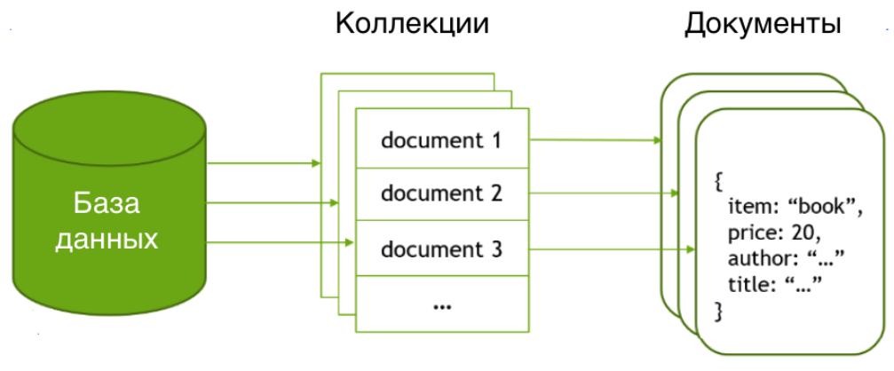
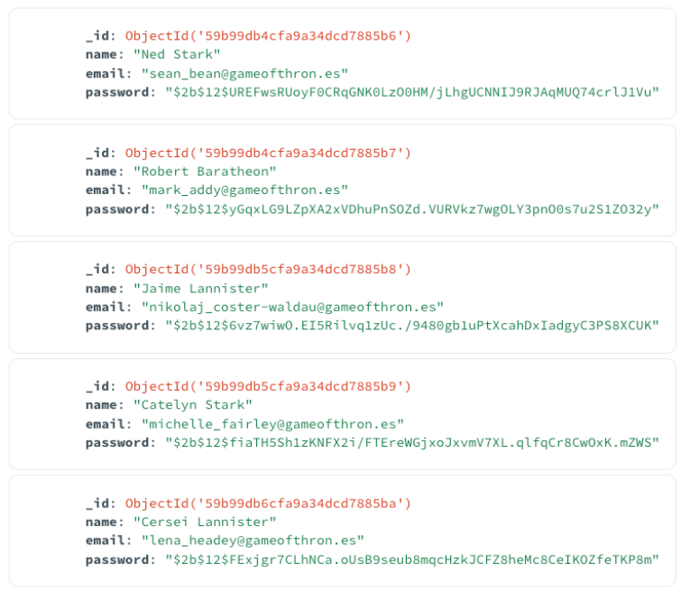
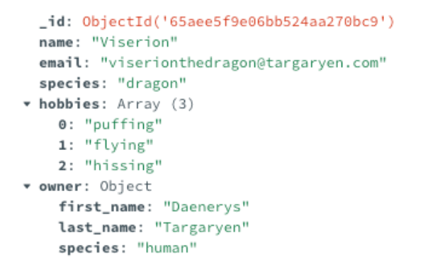
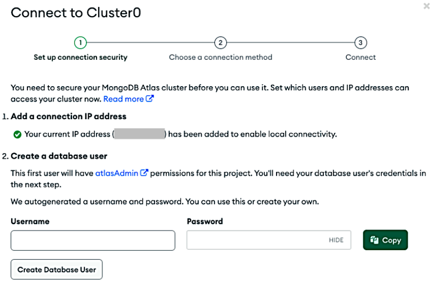
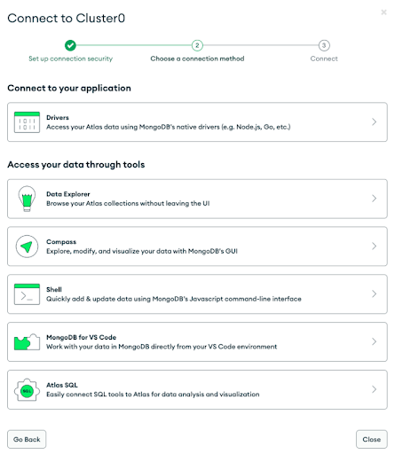
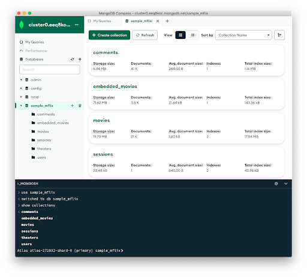

| **Цель занятия** | Разобраться, как именно концепция NoSQL помогает в управлении данными на примере документоориентированных баз данных. |
| **План занятия** |

-   Рассмотрим документоориентированные БД как частный случай нереляционных БД.
-   Разберем особенности документов как способа хранения данных.
-   Изучим основы устройства MongoDB --- СУБД, реализующей документоориентированную модель хранения данных.

 |

* * * * *

Применение документоориентированных баз данных

Идея документоориентированных баз данных возникла в связи с необходимостью хранить так называемые полуструктурированные данные.

Характеристики и примеры видов данных:

| **Структурированные данные** | **Неструктурированные данные** | **Полуструктурированные данные** |
| Имеют строго определенный набор полей | Понятие поля данных в принципе отсутствует | Набор полей может существенно варьироваться от записи к записи |
|

-   Электронная таблица
-   База данных SQL
-   Данные, получаемые из веб-форм или форм опроса

 |

-   Текст в свободной форме
-   Звукозапись
-   Видеозапись
-   Набор писем из электронного почтового ящика

 |

-   Данные о товарах в активно развиваемом интернет-магазине
-   Данные, поступающие из множества API для целей аналитики

 |

Как правило, для хранения полуструктурированных данных используются гибкие структуры, такие как документы XML и JSON, при этом схема данных может в принципе отсутствовать, а набор полей может меняться от записи к записи.

Например:

Документ 1:
{
    "FirstName": "Ivan",
    "City": "Moscow",
    "Hobby": "Hockey"
}

Документ 2:
{
    "FirstName": "Petr",
    "Hobby": "Soccer"
}

В рамках одной базы документы могут сохраняться в коллекции для того, чтобы объединить записи об однотипных объектах:

Источник: [sintesis.indrhi.gob.do](https://sintesis.indrhi.gob.do/)

Такой подход реализован во многих СУБД, в частности:

-   Clusterpoint Database.
-   Couchbase Server.
-   CouchDB.
-   DynamoDB.
-   Elasticsearch.
-   MarkLogic.
-   MongoDB.

Мы сфокусируемся на MongoDB как на наиболее распространенной СУБД.

Коллекции документов как способ управления данными

Если посмотреть на типичный набор документов в коллекции MongoDB, может сложиться впечатление, что мы имеем дело с реляционной таблицей, представленной в перевернутом виде:

Во многих случаях это будет действительно так. На скриншоте мы видим коллекцию документов, содержащих данные о четырех свойствах каждого пользователя: идентификатор (_id), имя (name), адрес электронной почты (email) и пароль (password).

Однако в эту коллекцию вполне можно добавить, например, такой документ:

Как видим, общими полями здесь являются только идентификатор, имя и адрес электронной почты. В добавленном документе нет поля пароля, зато есть ряд других полей, которые могут представлять собой списки значений (`hobbies`) или даже вложенные документы (`owner`).

Очевидно, что в случае представления тех же данных в реляционной модели новые поля пришлось бы вносить и в существующие записи (с пустым значением --- `NULL`). Для этого пришлось бы модифицировать схему данных, выполнив инструкцию `ALTER TABLE`.

Зачем может понадобиться создавать коллекции из столь неоднородных документов? В сфере аналитики бывают ситуации, когда данные собираются из нескольких источников --- например, путем их получения из API нескольких сторонних систем. Такой подход целесообразен, если нужно сделать быстро и получить единый набор данных.

Разумеется, дальнейшая агрегация и анализ данных потребуют дополнительных манипуляций путем написания кода. Однако на этапе сбора данных понадобится гораздо меньше усилий, чем при использовании реляционной базы данных.

Создание таких коллекций целесообразно при обработке любых полуструктурированных данных --- например, при разработке интернет-магазина с сильно отличающимися характеристиками товаров.

Приступаем к работе с MongoDB

Перечислим инструменты, которые используются для работы с MongoDB.

**Сервер.** Есть два вида серверов:

-   MongoDB Community Server --- бесплатный.
-   MongoDB Enterprise Server --- платный.

Для целей обучения вполне подойдет версия Community.

**Консольный клиент.** Консольная утилита MongoDB Shell (mongosh) используется в основном для целей администрирования, однако с ее помощью можно также обращаться к базе данных, используя синтаксис запросов Mongo.

**Графические клиенты.** Для работы с БД в графическом виде существует ряд инструментов;

-   MongoDB Compass,
-   Studio 3T,
-   NoSQLBooster и другие.

**Драйверы.** Чтобы подключить базу к разрабатываемому приложению, понадобится драйвер для того или иного языка программирования:

-   для Java,
-   для Python,
-   для Node.js и других языков программирования.

Все перечисленные инструменты кросс-платформенные и доступны на всех основных операционных системах.

Кроме того, MongoDB доступна как облачный сервис под названием [MongoDB Atlas](https://cloud.mongodb.com/). Это самый простой способ познакомиться с системой, т. к. в сервисе доступен бесплатный уровень пользования.

Чтобы начать работу с сервисом, необходимо пройти регистрацию и создать deployment. Для начала можно выбрать уровень M0 (бесплатная «песочница»). При этом есть опция `Add sample dataset`, которую следует включить, чтобы в дальнейшем была доступна тестовая база данных.

После создания кластера задаются параметры безопасности. В них будет сохранен текущий IP-адрес вашего локального компьютера, а также будет сгенерирован пароль для доступа к базе данных:

В дальнейшем в эти параметры можно будет добавить необходимые адреса и пользователей.

На следующем шаге мастер настройки предложит варианты подключения к создаваемой базе. Здесь появится возможность загрузить Compass или драйверы для того или иного языка программирования:

Наконец, мы получаем строку подключения, которую сможем использовать в клиентском инструменте для соединения с базой данных:

После этого можно открыть Compass, ввести полученную строку с параметрами подключения (connection string) и получить доступ к сервису.

По умолчанию должны отобразиться три базы данных:

1.  База данных `local`, хранящая метаданные для того узла, на котором установлена MongoDB (эта БД не будет реплицироваться на другие узлы при их наличии).
2.  База данных `admin`, используемая для аутентификации, авторизации и административных целей.
3.  База данных `config`, используемая для хранения метаданных для сегментирования.

Кроме того, на скриншоте видно тестовую базу данных, предоставленную сервисом. Также стоит обратить внимание, что в нижней части экрана присутствует командная строка, идентичная той, что доступна в утилите MongoDB Shell.

Получив доступ к сервису и тестовой базе, можно начинать практику.

* * * * *

Итоги занятия:

-   Документоориентированные базы данных хорошо подходят для хранения полуструктурированных данных.
-   Документы в таких базах объединяются в коллекции, при этом набор полей в документах одной коллекции может различаться.
-   MongoDB --- наиболее популярная СУБД этого класса, которая в том числе доступна как сервис.